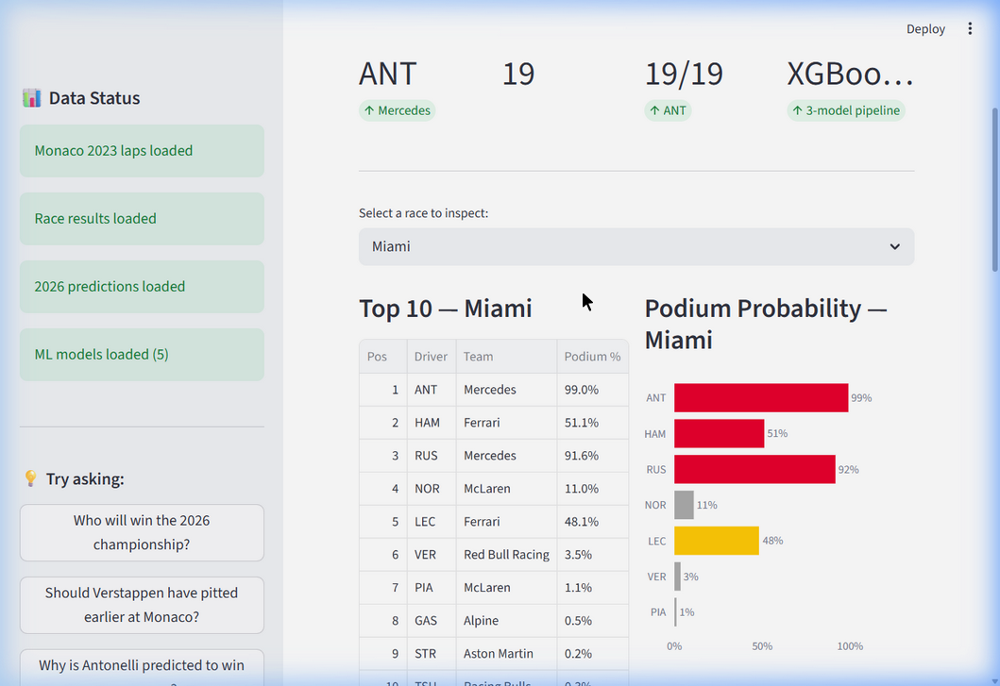
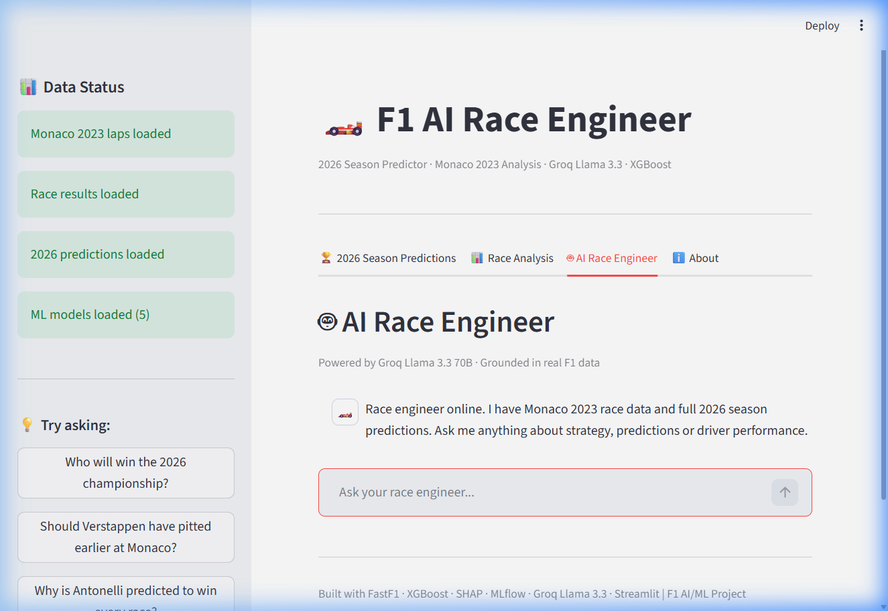

<div align="center">
  
  
  <h1>F1 AI/ML Project</h1>
  
  
  
  
  
  
  

  **An end-to-end data science and AI project built on Formula 1 race data.**
  
  _Covers data engineering, machine learning, and an AI race engineer agent._
</div>

---

Features a full **2026 Season Predictor** trained on FastF1 historical data using a 3-model XGBoost pipeline!





---

## Project structure

```
f1_project/
├── assets/               # README images
├── data/
│   ├── raw/fastf1_cache/ # FastF1 cached telemetry (gitignored)
│   ├── processed/        # cleaned CSVs, 2026 predictions
│   └── models/           # trained XGBoost models (.pkl)
├── notebooks/
│   └── f1_2026_predictor.ipynb
├── src/
│   ├── data.py           # data extraction from FastF1
│   ├── features.py       # advanced robust feature engineering
│   └── model.py          # time-series cross validation & ML pipeline
├── 01_data_pull.py       # (Phase 1) Telemetry basic extraction
├── 02_eda.py             # (Phase 2) Exploratory data analysis
├── 03_ml_model.py        # (Phase 3) ML training and 2026 prediction generator
├── 04_ai_race_engineer.py# (Phase 4) Streamlit AI race engineer web app
├── setup.sh
├── requirements.txt
└── README.md
```

---

## Phases

| Phase | What | Tools |
|-------|------|-------|
| 1 | Data pull & exploration | FastF1, pandas, Plotly |
| 2 | EDA & visual storytelling | Plotly, Seaborn |
| 3 | GP winner & Podium Prediction Model | XGBoost, Time-Series CV, MLflow, SHAP |
| 4 | AI race engineer chatbot & UI | Groq (Llama 3.3 70B), Streamlit |

---

## Quickstart

```bash
# 1. Clone the repo
git clone https://github.com/YOUR_USERNAME/f1-ai-ml.git
cd f1-ai-ml

# 2. Create environment
bash setup.sh
source venv/bin/activate  # Or venv\Scripts\activate on Windows

# 3. Generate Models and Predictions
python 03_ml_model.py

# 4. Launch the AI Race Engineer UI
streamlit run 04_ai_race_engineer.py
```

---

## Technical Details

**Addressing Data Leakage**
Models are trained utilizing ONLY data available **before** the race begins (Grid Position, 3-race Constructor Momentum, Rolling Driver Form, DNF risks). This ensures authentic predictive validity.

**Cross-Validation Strategy**
Uses Chronological `TimeSeriesSplit` to strictly prevent looking into the future of sports events during model evaluation.

**Data sources**
- [FastF1](https://docs.fastf1.dev/) — lap telemetry, tyre data, weather (2018–present)
- [OpenF1 API](https://openf1.org/) — live race data, team radio
- [Kaggle: jtrotman/formula-1-race-data](https://www.kaggle.com/datasets/jtrotman/formula-1-race-data) — historical results 1950–2023

---

## Requirements

```
fastf1
pandas
plotly
scikit-learn
xgboost
shap
mlflow
streamlit
groq
python-dotenv
```

---

## Author

Ayush Ratna — [LinkedIn](https://www.linkedin.com/in/ayush-ratna27/) · [GitHub](https://github.com/Ayush-delta)
